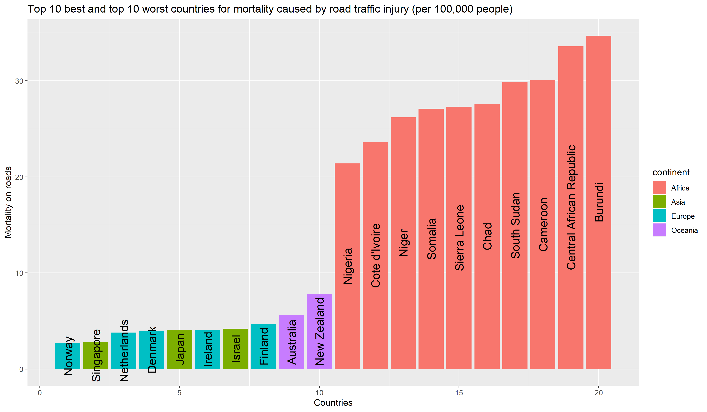
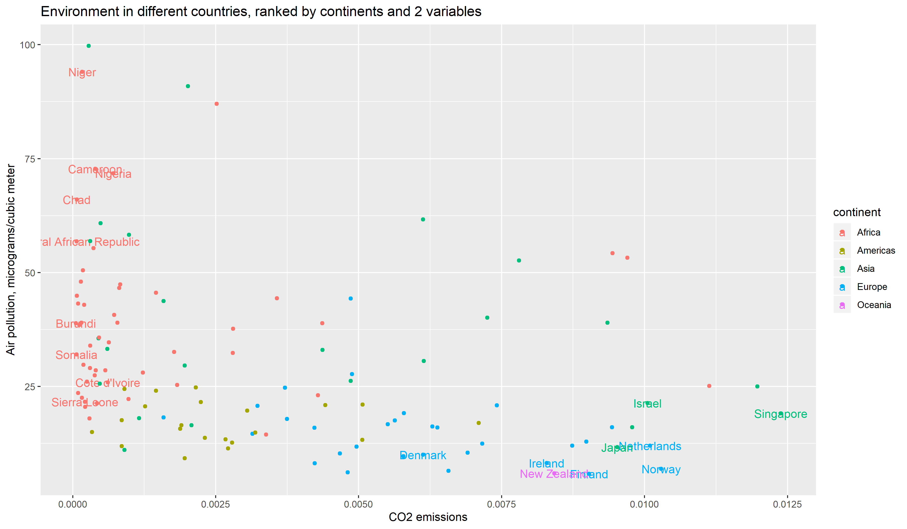

Which Country is the Best to Live in?
========================================================
author: Kirill Tumanov, Mattia Storero, Lucas Stark
date: 14.11.2019
autosize: true

What is Life Quality about?
========================================================

Variables (included and excluded)
========================================================

<table class="table table-striped table-hover" style="margin-left: auto; margin-right: auto;">
<caption>Life Quality Factors</caption>
 <thead>
  <tr>
   <th style="text-align:left;"> Health </th>
   <th style="text-align:left;"> Economy </th>
   <th style="text-align:left;"> Safety </th>
   <th style="text-align:left;"> Education </th>
   <th style="text-align:left;"> Environment </th>
  </tr>
 </thead>
<tbody>
  <tr>
   <td style="text-align:left;color: black !important;color: black !important;"> % Survival to age 65 (male) </td>
   <td style="text-align:left;color: black !important;"> GDP per capita </td>
   <td style="text-align:left;color: black !important;"> Mortality due to bad hygiene and unclean water per 1,000 </td>
   <td style="text-align:left;color: black !important;"> % of children in primary education </td>
   <td style="text-align:left;color: red !important;color: black !important;"> Air pollution </td>
  </tr>
  <tr>
   <td style="text-align:left;color: black !important;color: black !important;"> % Survival to age 65 (female) </td>
   <td style="text-align:left;color: black !important;"> Gini Coefficient </td>
   <td style="text-align:left;color: black !important;"> Mortality due to traffic accidents per 1,000 </td>
   <td style="text-align:left;color: black !important;"> % of children in secondary education </td>
   <td style="text-align:left;color: red !important;color: black !important;"> CO2 emmissions </td>
  </tr>
  <tr>
   <td style="text-align:left;color: black !important;"> Life Expectancy </td>
   <td style="text-align:left;"> Unemployment </td>
   <td style="text-align:left;"> Mortality due to unintended poisoning per 1,000 </td>
   <td style="text-align:left;"> % of students receive monetary support from government in primary education </td>
   <td style="text-align:left;color: red !important;">  </td>
  </tr>
  <tr>
   <td style="text-align:left;color: black !important;"> % Access to clean cooking </td>
   <td style="text-align:left;">  </td>
   <td style="text-align:left;">  </td>
   <td style="text-align:left;"> % of students receive monetary support from government in secondary education </td>
   <td style="text-align:left;color: red !important;"> Level of water stress </td>
  </tr>
  <tr>
   <td style="text-align:left;color: red !important;color: black !important;"> Child mortality per 1,000 live births </td>
   <td style="text-align:left;color: red !important;">  </td>
   <td style="text-align:left;color: red !important;"> Mortality due to homicide per 1,000 </td>
   <td style="text-align:left;color: red !important;"> Male to female ratio in secondary education </td>
   <td style="text-align:left;color: red !important;color: red !important;"> Renewable internal freshwater resources per capita </td>
  </tr>
</tbody>
</table>

The Best and the Worst
=========================================================

An overview of Life Quality
========================================================

Health
========================================

Economy
=======================================

Economy
=======================================

Safety
========================================

Safety
========================================

Environment
========================================

Conclusion
========================================
- Norway is the best country to live in according to our analysis
- Corresponds OECD "Better Life Index"
- 5/10 matches in Top 10: Norway, Australia, Denmark, the Netherlands, and Finland. 

Thank you for your attention!
========================================

